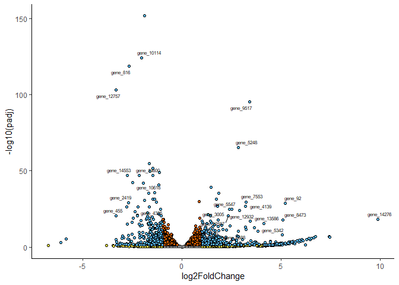
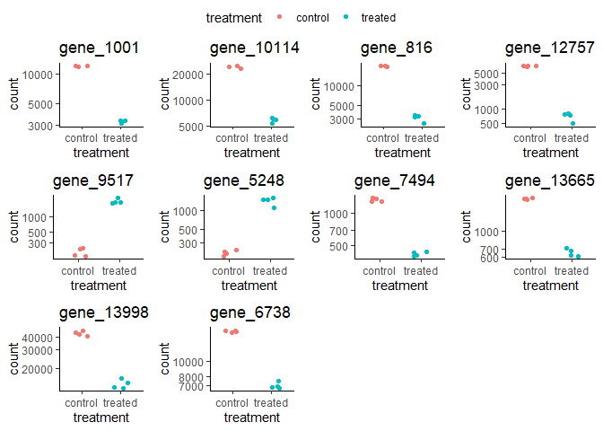
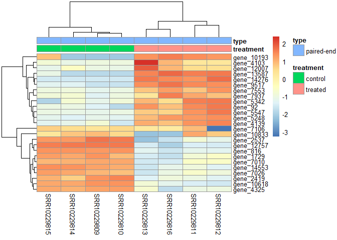
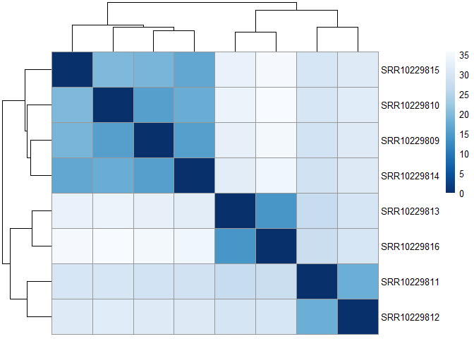
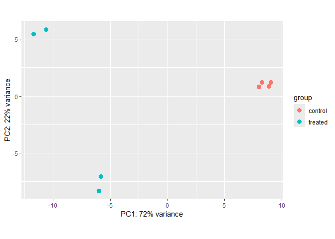

# Introduction

This document presents a complete workflow for differential gene
expression analysis using the DESeq2 package in R. The analysis focuses
on *Fusarium bataticola* under two treatment conditions: control and
treated (e.g., host extract exposure). The pipeline includes data
loading, filtering, model fitting, result interpretation, and
visualization.

The input file used here is the output obtained after running the prepDy
code.

# Step 1: Install and Load Required Packages

We begin by ensuring all required libraries are installed and loaded.
These include DESeq2 for differential expression analysis and additional
libraries for visualization.

``` r
#if (!requireNamespace("BiocManager", quietly = TRUE)) install.packages("BiocManager")
#BiocManager::install("DESeq2")

#install.packages("ggpubr")
#install.packages("ggrepel")
#install.packages("pheatmap")
#install.packages("ggplot2")

library(DESeq2)
library(ggplot2)
library(ggrepel)
library(pheatmap)
library(RColorBrewer)
library(ggpubr)
```

We also define a custom color palette to use in plots throughout the
analysis.

``` r
cbbPalette <- c("#000000", "#E69F00", "#56B4E9", "#009E73", 
                "#F0E442", "#0072B2", "#D55E00", "#CC79A7")
```

# Step 2: Load Count Matrix and Sample Metadata

We load the gene count matrix generated from RNA-seq read
quantification, and the sample metadata (e.g., treatment groups and
types).

``` r
countdata <- as.matrix(read.csv("Fusarium_bataticola/gene_count_matrix.csv", 
                                row.names = 1))
coldata <- read.table("Fusarium_bataticola/PHENO_DATA.txt", 
                      header = TRUE, row.names = 1)
```

We ensure that sample names match across the count data and metadata,
and that the order is synchronized.

``` r
all(rownames(coldata) %in% colnames(countdata))
```

    ## [1] TRUE

``` r
countdata <- countdata[, rownames(coldata)]
all(rownames(coldata) == colnames(countdata))
```

    ## [1] TRUE

# Step 3: Create DESeq2 Dataset

We now construct a DESeqDataSet object. This step also includes a
prefiltering step to exclude genes with low overall read counts, which
improves statistical power.

``` r
dds <- DESeqDataSetFromMatrix(countData = countdata, 
                              colData = coldata, 
                              design = ~ treatment)
```

    ## Warning in DESeqDataSet(se, design = design, ignoreRank): some variables in
    ## design formula are characters, converting to factors

``` r
dds <- dds[rowSums(counts(dds)) > 20, ]
dds$treatment <- factor(dds$treatment, levels = c("control", "treated"))
```

# Step 4: Run DESeq2 Analysis

DESeq2 will estimate size factors, dispersion, and fit the model.
Results are extracted both with the default and a specified alpha level.

``` r
dds <- DESeq(dds)
```

    ## estimating size factors

    ## estimating dispersions

    ## gene-wise dispersion estimates

    ## mean-dispersion relationship

    ## final dispersion estimates

    ## fitting model and testing

``` r
res <- results(dds)
resOrdered <- res[order(res$padj),]
res05 <- results(dds, alpha = 0.05)
```

We then generate summaries of the number of differentially expressed
genes at adjusted p-value thresholds of 0.1 and 0.05.

``` r
summary(res)
```

    ## 
    ## out of 11344 with nonzero total read count
    ## adjusted p-value < 0.1
    ## LFC > 0 (up)       : 1530, 13%
    ## LFC < 0 (down)     : 1320, 12%
    ## outliers [1]       : 9, 0.079%
    ## low counts [2]     : 655, 5.8%
    ## (mean count < 2)
    ## [1] see 'cooksCutoff' argument of ?results
    ## [2] see 'independentFiltering' argument of ?results

``` r
sum(res$padj < 0.1, na.rm = TRUE)
```

    ## [1] 2850

``` r
summary(res05)
```

    ## 
    ## out of 11344 with nonzero total read count
    ## adjusted p-value < 0.05
    ## LFC > 0 (up)       : 1179, 10%
    ## LFC < 0 (down)     : 1072, 9.4%
    ## outliers [1]       : 9, 0.079%
    ## low counts [2]     : 1314, 12%
    ## (mean count < 4)
    ## [1] see 'cooksCutoff' argument of ?results
    ## [2] see 'independentFiltering' argument of ?results

``` r
sum(res05$padj < 0.05, na.rm = TRUE)
```

    ## [1] 2251

# Step 5: Volcano Plot (ggplot2)

We generate a volcano plot to visualize statistical significance (-log10
adjusted p-values) against effect size (log2 fold change).

``` r
res_df <- as.data.frame(res)
res_df$significant <- ifelse(res_df$padj < 0.05, "yes", "no")
res_df$label <- rownames(res_df)
logfc.threshold <- 1

ggplot() + 
  geom_point(data = subset(res_df, padj > 0.05 & abs(log2FoldChange) < logfc.threshold),
             aes(x = log2FoldChange, y = -log10(padj)), fill = "grey", shape = 21, alpha = 0.5) + 
  geom_point(data = subset(res_df, padj < 0.05),
             aes(x = log2FoldChange, y = -log10(padj)), fill = cbbPalette[[7]], shape=21) + 
  geom_point(data = subset(res_df, abs(log2FoldChange) > logfc.threshold),
             aes(x = log2FoldChange, y = -log10(padj)), fill = cbbPalette[[5]], shape = 21) + 
  geom_point(data = subset(res_df, padj < 0.05 & abs(log2FoldChange) > logfc.threshold),
             aes(x = log2FoldChange, y = -log10(padj)), fill = cbbPalette[[3]], shape = 21) +
  theme_classic() +
  geom_text_repel(data = subset(res_df, -log10(padj) > 10 & abs(log2FoldChange) > 2),
                  aes(x = log2FoldChange, y = -log10(padj), label = label), size = 2)
```

    ## Warning: Removed 411 rows containing missing values or values outside the scale range
    ## (`geom_point()`).

    ## Warning: ggrepel: 17 unlabeled data points (too many overlaps). Consider
    ## increasing max.overlaps

<!-- -->

# Step 6: Plot Counts for Individual Genes

We perform a sanity check by visualizing normalized counts for
individual genes with lowest 10 padjusted values across treatment
groups.

``` r
top10_genes <- rownames(res[order(res$padj), ])[1:10]

plots <- list()

for (i in 1:10) {
  gene <- top10_genes[i]
  df <- plotCounts(dds, gene = gene, intgroup = "treatment", returnData = TRUE)
  p <- ggplot(df, aes(x = treatment, y = count, color = treatment, fill= treatment)) +
    geom_jitter(width = 0.2,shape = 21) +
    scale_y_log10() +
    ggtitle(gene) +
    theme_classic()
  plots[[i]] <- p
}

plotcounts<- ggarrange(plotlist = plots, ncol = 4, nrow = 3, common.legend=T)


plotcounts
```

<!-- -->

# Step 7: Save DESeq2 Results

Save the ordered results table as a CSV file for downstream use or
record-keeping.

``` r
write.csv(as.data.frame(resOrdered), file = "Fusarium_bataticola/DGESeq_results.csv")
```

# Step 8: Data Transformation for Visualization

We apply two transformation methods (rlog and VST) to stabilize the
variance across samples, making the data suitable for visualization.

``` r
rld <- rlog(dds)
vsd <- varianceStabilizingTransformation(dds)
```

# Step 9: Heatmap of Highly Variable Genes

This step generates a heatmap of the 25 most variable genes to reveal
clustering patterns across samples.

``` r
topVarGenes <- head(order(rowVars(assay(vsd)), decreasing = TRUE), 25)
mat <- assay(vsd)[topVarGenes, ]
mat <- mat - rowMeans(mat)
anno <- as.data.frame(colData(vsd)[, c("treatment", "type")])
pheatmap(mat, annotation_col = anno,cellwidth = NA, cellheight = NA)
```

<!-- -->

# Step 10: Sample Distance Heatmap

We compute Euclidean distances between samples and display the distances
in a clustered heatmap.

``` r
sampleDists <- dist(t(assay(rld)))
sampleDistMatrix <- as.matrix(sampleDists)
rownames(sampleDistMatrix) <- colnames(rld)
colnames(sampleDistMatrix) <- NULL
colors <- colorRampPalette(rev(brewer.pal(9, "Blues")))(255)
pheatmap(sampleDistMatrix, clustering_distance_rows = sampleDists,
         clustering_distance_cols = sampleDists, col = colors)
```

<!-- -->

# Step 11: Principal Component Analysis

PCA reduces data dimensionality to visualize overall differences between
sample groups based on variance.

``` r
plotPCA(rld, intgroup = c("treatment"))
```

    ## using ntop=500 top features by variance

<!-- -->
